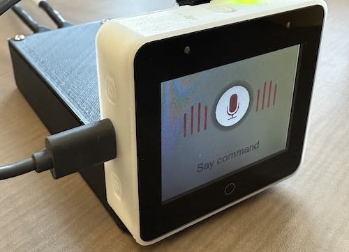
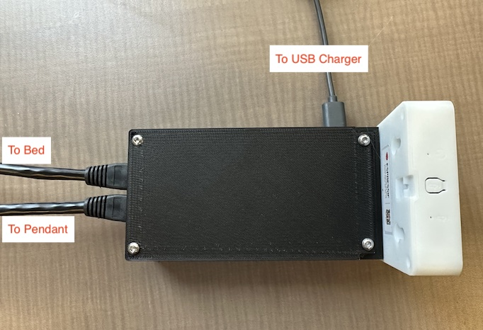

# esp-bed-control

This project defines a voice-control module designed to allow voice control of hospital beds for. This allows patients who are unable to use the pendant normally attached to the bed to adjust their bed position themselves.



The device is based on the ESP BOX by espressif. This is a self-contained unit that includes an ESP32-S3, speakers, a microphone, and a screen. It also includes software for voice control.

The device itself is designed to be modular for use on a wide variety of beds. It consists of 3 major components:
  - The ESP Box (performs the voice recognition, user feedback, and logic).
  - The ESP hospital bed dock. This is a custom PCB that the ESP box can dock onto. It takes signals from 6 GPIO pins and routes them to 6 solid-state relays. These relays act as "loop closures", simulating a real hospital bed pendant. These 6 loop closures have 12 associated leads that are mapped to the first 12 pins of a male DB25 port. The dock also has a USB-C port for charging, and an RJ45 port that was only included to allow for future expansion of the project, but is not currently in use.
  - The hospital bed interface PCB. This is another custom PCB which must be designed specifically for the bed in question. Its role is to take the loop closers from the DB25 port on the dock PCB, and map them to the right pins of the pendant. It should connect to the bed, and to the pendant, such that the pendant continues to work as normal. We have designed one such interface board for the "New Span America" hospital beds. 

The hookup diagram is shown below.



The entire device is housed inside a 3D printed shell. The STL files for this shell are included in the /cad folder.

Documentation can be found in ``docs/instructions.pdf``.

## Available Commands

When you plug in the ESP box (after its been flashed and assembled), it will startup for a short period then "ding" to indicate that it is ready. It can then be woken with the wake word "Hi E.S.P.". Once it has woken, any of the following commands may be issued:
- Headrest up/down
- Legrest up/down
- Bed up/down
Each of these commands can be modified with "a little bit", "way", or "fully", e.g. "Headrest a little up", "Headrest way up", or "Headrest fully up". The nominal command closes the relay for 2 seconds. "A little bit" is only 1 second, "way" is 4 seconds, and "fully" is 15 seconds.

## PCB Manufacturing

To manufacture the PCB, you will need to have some experience with custom PCB manufacturing. Kicad schematics and PCB layouts are provided for all boards, as well as PDF's. These are all in the /pcb folder.

## Programming the ESP Box

Programming the ESP box is a bit challenging, since documentation is limited. However, our program is relatively well commented and is included here under the /src folder. The main components of this software are listed below:
  - ``main.c``: Initiates the program, assigns the GPIO pins
  - ``/gui/ui_sr.c``: Includes the code to how the UI displays for the speech recognition.
  - ``/gui/ui_main.c``: Includes other code on how the UI works
  - ``/app/app_audio.c``: Initializes the speaker output.
  - ``/app/app_lvgl.c``: Initializes the screen of the devices.
  - ``/app/app_sr_handler.c``: Contains the logic of how to respond to different voice commands.
  - ``/app/app_sr.c``: Contains code for the actual voice recognition itself.

## Flashing the ESP Box

To flash the ESP box, follow these steps.
1. Open/Install VScode, and install the Espressif IDE plugin. [Instructions here](https://docs.espressif.com/projects/esp-idf/en/latest/esp32/get-started/index.html). You may take some time to get familiar with the programming environment.
2. Next, setting up development environment. Please refer to [ESP-IDF (release/v5.0)](https://docs.espressif.com/projects/esp-idf/en/release-v4.4/esp32s3/get-started/index.html#installation-step-by-step) Installation Step by Step.
3. Run command ``git clone --recursive https://github.com/espressif/esp-box.git`` somewhere on your machine to download the code of this project and then switch the ESP-IDF version to specified version.
4. Open up the ``/src`` folder and link the "components" of the project in ``CMakeLists.txt``. E.g., replace the lines
  ```
  set(EXTRA_COMPONENT_DIRS
      path/to/esp-box/components
      )
  ```
5. Connect, build and flash the device.

## Customizing the voice commands

In VS code, open the ESP-IDF Terminal (it may already be open, otherwise there is a button in the bottom that opens it). To customize the voice commands you need to run the ``idf.py menuconfig`` command, and customize the commands that the board listens to.  This is done under the ``ESP Speech Recognition`` menu item, followed by ``Add English speech commands``. You may also customize the wakeword under the ``Select wake words`` menu item.

You will need to generate the G2P phrase for each voice command. A description of how to do this is given in ``esp-box/components/esp-sr/tool``. A list of the G2P commands for all the default commands are given in ``docs/commands.xlsx``.

Once this is complete, you should modify the handling of each of these voice commands with appropriate modifications to ``app/app_sr_handler.c``. Each voice command in the menuconfig settings is keyed to its ID number, so the ``app_sr_handler`` code simply runs that ID through a switch statement to run the appropriate code.

